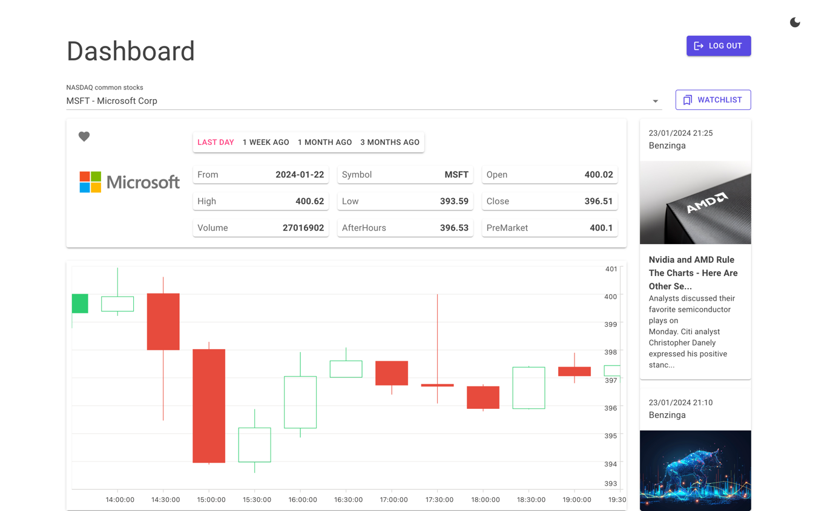
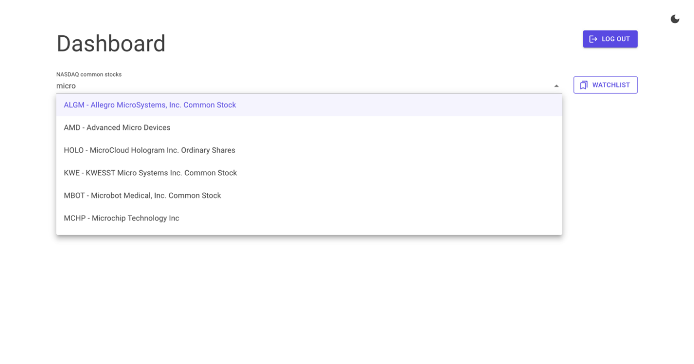
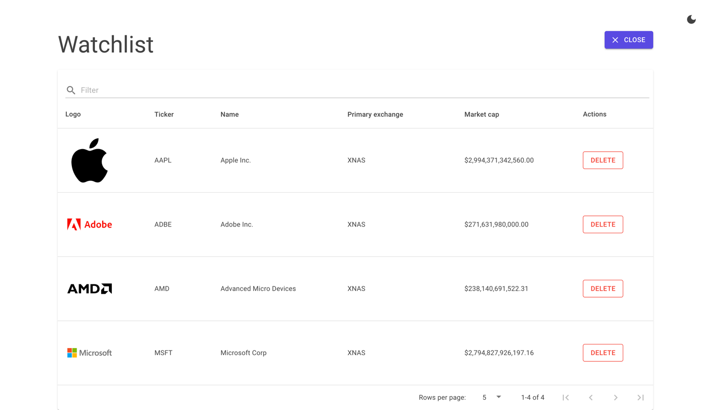
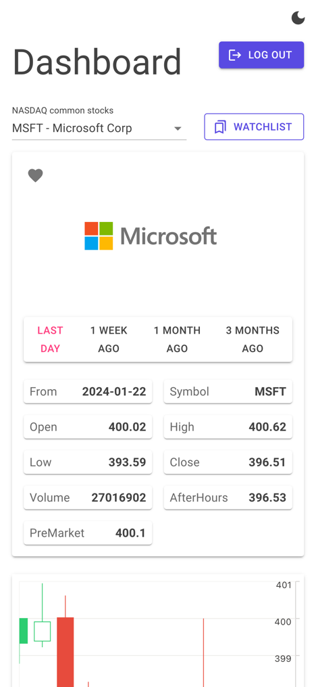
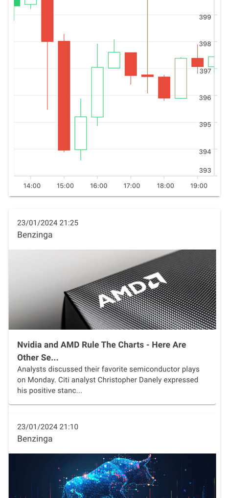
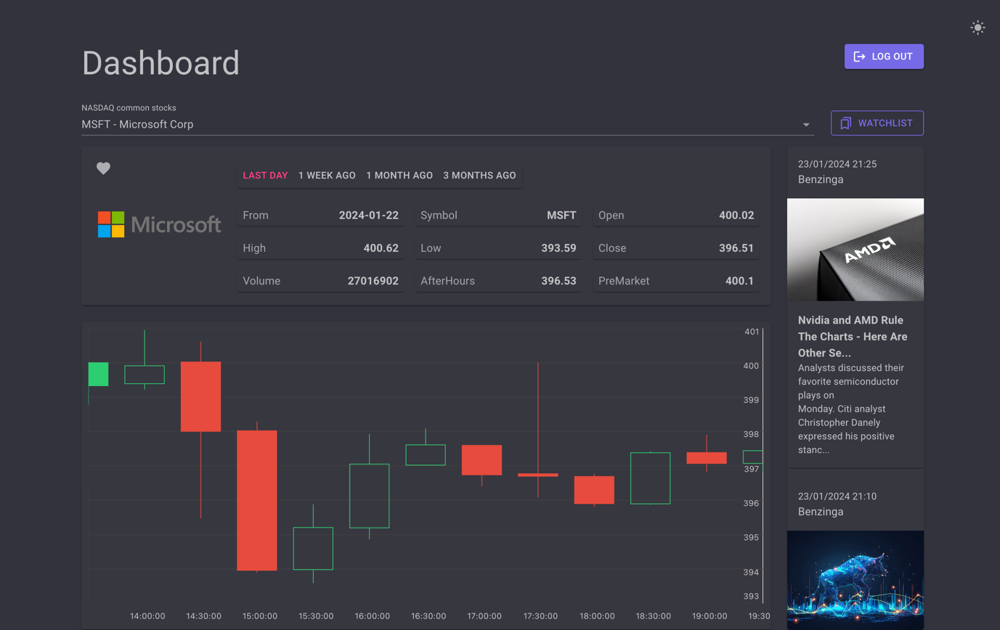
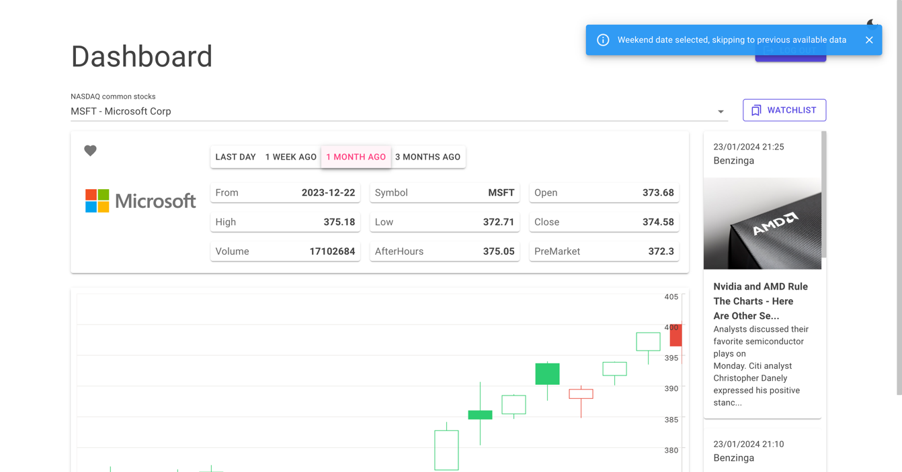
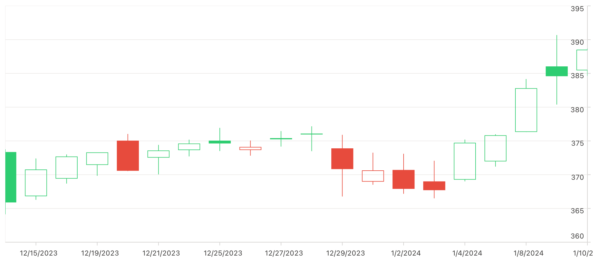
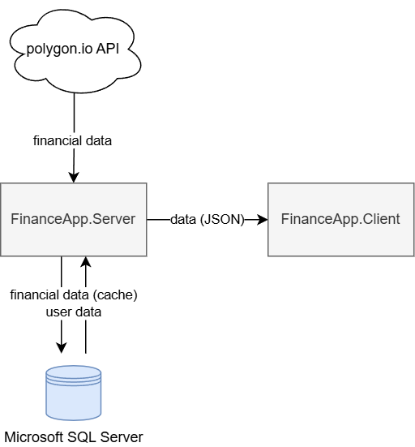

# FinanceApp - Blazor WebAssembly Stock Dashboard

A full-stack stock market dashboard built with **Blazor WebAssembly** and **ASP.NET Core**. It fetches real-time financial data from the [Polygon.io](https://polygon.io/) API and presents interactive candlestick charts, daily OHLC prices, company details, and financial news - all within a responsive, theme-aware UI.

Built as part of an engineering thesis on WebAssembly and its practical applications ([PJAIT](https://www.pja.edu.pl/en/), January 2024).



## Features

**Stock data & search**
- Autocomplete search across 3 000+ NASDAQ common stock tickers
- Company details: name, ticker, exchange, market cap, logo, website
- Daily open/close prices with pre-market and after-hours data

**Interactive charts**
- Candlestick (OHLC) stock charts powered by Syncfusion StockChart
- Multiple timeframes: last day (30 min), 1 week (3 h), 1 month (daily), 3 months (weekly)

**Watchlist**
- Save companies to a personal watchlist
- Filterable, sortable table with logos, tickers, exchanges, and market caps

**News feed**
- Financial news articles displayed alongside stock data
- Sourced from Polygon.io with cached images

**Dark / light theme**
- Toggle between dark and light modes; the entire UI (including charts) adapts

**Responsive design**
- Works on desktop and mobile screen sizes via MudBlazor's responsive grid

## Screenshots

### Ticker search with autocomplete


### Watchlist


### Mobile views
<p float="left">
  
  
</p>

<details>
<summary>More screenshots</summary>

### Dark mode


### Dashboard - monthly view with weekend skip notification


### Candlestick chart (close-up)


</details>

## Architecture



The application follows the **Blazor WebAssembly Hosted** model with three projects:

| Project | Role |
|---|---|
| **FinanceApp.Client** | Blazor WebAssembly front-end (runs in the browser) |
| **FinanceApp.Server** | ASP.NET Core Web API back-end |
| **FinanceApp.Shared** | Shared DTOs and models used by both Client and Server |

Data flows as follows:

1. **Polygon.io API** provides financial data (tickers, prices, charts, news)
2. **FinanceApp.Server** fetches from Polygon.io, caches results in **MS SQL Server**, and serves JSON to the client
3. **FinanceApp.Client** renders the UI in the browser via WebAssembly

The caching layer is key: Polygon.io's free tier is rate-limited, so all fetched data is persisted to the database. Subsequent requests are served from cache, and users can still browse previously loaded data even when the API limit is reached.

## Tech stack

**Client-side**
- [Blazor WebAssembly](https://learn.microsoft.com/en-us/aspnet/core/blazor/) (.NET 8.0)
- [MudBlazor](https://mudblazor.com/) - Material Design component library
- [Syncfusion Blazor StockChart](https://www.syncfusion.com/blazor-components/blazor-stock-chart) - financial data visualization

**Server-side**
- ASP.NET Core Web API (.NET 8.0)
- Entity Framework Core 8.0 (SQL Server)
- [Duende IdentityServer](https://duendesoftware.com/products/identityserver) - authentication & authorization
- AutoMapper - object mapping

**Infrastructure**
- Microsoft SQL Server 2022 (via Docker Compose)

## Getting started

### Prerequisites

- [.NET 8.0 SDK](https://dotnet.microsoft.com/download/dotnet/8.0)
- [Docker](https://www.docker.com/) (for the SQL Server container)
- A free [Polygon.io](https://polygon.io/) API key

### Setup

1. **Clone the repository**
   ```bash
   git clone https://github.com/karolpela/blazor-polygon-io-dashboard.git
   cd blazor-polygon-io-dashboard
   ```

2. **Start the SQL Server container**
   ```bash
   docker compose up -d
   ```

3. **Configure the Polygon.io API key**

   Use .NET User Secrets for the Server project:
   ```bash
   cd Server
   dotnet user-secrets set "PolygonApiKey" "<your-api-key>"
   cd ..
   ```

4. **Run the application**
   ```bash
   dotnet run --project Server
   ```
   The app will be available at `https://localhost:7103`.

## Credits

- [Polygon.io](https://polygon.io/) - financial data API
- [MudBlazor](https://mudblazor.com/) - UI components
- [Syncfusion](https://www.syncfusion.com/) - Blazor Stock Chart component
